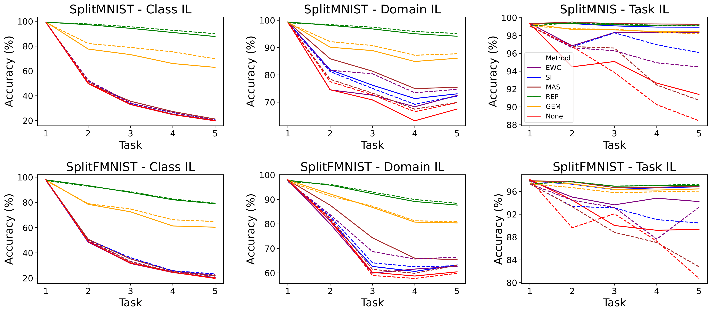

# A Contrastive Symmetric Forward-Forward Algorithm (SFFA) for Continual Learning Tasks

Repository for the paper "A Contrastive Symmetric Forward-Forward Algorithm (SFFA) for Continual Learning Tasks" for CoLLAs 2024. [[URL](https://openreview.net/forum?id=ozeIV1sU77)]

Abstract: _The so-called Forward-Forward Algorithm (FFA) has recently gained momentum as an alternative to the conventional backpropagation algorithm for neural network learning, yielding competitive performance across various modeling tasks. By replacing the backward pass of gradient backpropagation with two contrastive forward passes, the FFA avoids several shortcomings undergone by its predecessor (e.g., vanishing/exploding gradient) by enabling layer-wise training heuristics. In classification tasks, this contrastive method has been proven to effectively create a latent sparse representation of the input data, ultimately favoring discriminability. However, FFA exhibits an inherent asymmetric gradient behavior due to an imbalanced loss function between positive and negative data, adversely impacting on the model's generalization capabilities and leading to an accuracy degradation. To address this issue, this work proposes the Symmetric Forward-Forward Algorithm (SFFA), a novel modification of the original FFA which partitions each layer into positive and negative neurons. This allows the local fitness function to be defined as the ratio between the activation of positive neurons and the overall layer activity, resulting in a symmetric loss landscape during the training phase. To evaluate the enhanced convergence of our method, we conduct several experiments using multiple image classification benchmarks, comparing the accuracy of models trained with sFFA to those trained with its FFA counterpart. As a byproduct of this reformulation, we explore the advantages of using a layer-wise training algorithm for Continual Learning (CL) tasks. The specialization of neurons and the sparsity of their activations induced by layer-wise training algorithms enable efficient CL strategies that incorporate new knowledge (classes) into the neural network, while preventing catastrophic forgetting of previously learned concepts. Experiments in three CL scenarios (Class, Domain, and Task Incremental) using multiple well-known CL techniques (e.g., EWC and GEM) are discussed to analyze the differences between our sFFA model and a model trained using backpropagation. Our results demonstrate that the herein proposed sFFA achieves competitive levels of accuracy when compared to the off-the-shelf FFA, maintaining sparse latent activity, and resulting in a more precise goodness function. Our findings support the effectiveness of sFFA in CL tasks, highlighting its natural complementarity with techniques devised for this modeling paradigm._

# Install

To set up the required dependencies, refer to the requirements.txt file and install them using the following pip command:

> pip install -r requirements.txt


# Experiments

To run the training experiments run

> python train.py

To run the CL experimetns run

> python continual.py

All hyperparameters necessary for both types of experiments are defined within the respective Python files (_train.py_ and _continual.py_). Customize these hyperparameters according to your experimental needs.

# Results

The results obtained in the paper are presented in the folder experiments, but the code to reproduce them is presented in this repository.




# Citation

To cite this work if you find it useful for your work:

```
@inproceedings{
terresescudero2024sffa,
title={A Contrastive Symmetric Forward-Forward Algorithm ({SFFA}) for Continual Learning Tasks},
author={Terres-Escudero, Erik Bernardo and Del Ser, Javier and Garcia-Bringas, Pablo},
booktitle={Third Conference on Lifelong Learning Agents},
year={2024},
url={https://openreview.net/forum?id=ozeIV1sU77}
}
```